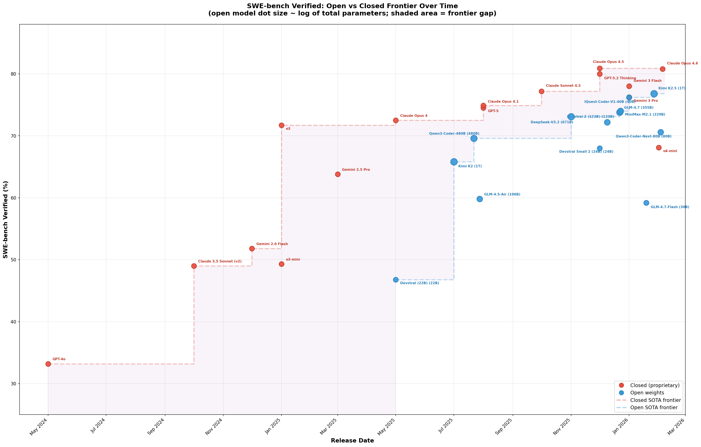

# llm-info

Historical registry of AI model cards and benchmark scores, designed for plotting capability trends over time — how fast the frontier moves, how quickly open models catch up, and where the gaps are.



## What's in here

- **30 model cards** (14 open-weight, 16 closed) across 10 providers
- **62 benchmark definitions** spanning coding, reasoning, knowledge, multimodal, safety, and more
- **JSON Schema** for both models and benchmarks, enabling validation and tooling

## Repo structure

```
schema/
  model-card.schema.json    # JSON Schema for model cards
  benchmark.schema.json     # JSON Schema for benchmarks
models/                     # One JSON file per model
benchmarks/                 # One JSON file per benchmark
```

## Models covered

| Provider | Models |
|----------|--------|
| Anthropic | Claude 3.5 Sonnet v2, Opus 4/4.1/4.5/4.6, Sonnet 4.5 |
| OpenAI | GPT-4o, GPT-5, GPT-5.2 Thinking, o3, o3-mini, o4-mini |
| Google DeepMind | Gemini 2.0 Flash, 2.5 Pro, 3 Flash, 3 Pro |
| Alibaba (Qwen) | Qwen2.5-Coder-32B, Qwen3-Coder-480B, Qwen3-Coder-Next-80B |
| DeepSeek | DeepSeek-V3.2 |
| Moonshot AI | Kimi K2, K2.5 |
| Mistral AI | Devstral (22B), Devstral 2 (123B), Devstral Small 2 (24B) |
| Zhipu AI | GLM-4.5-Air, GLM-4.7, GLM-4.7-Flash |
| MiniMax | MiniMax-M2.1 |
| IQuestLab | IQuest-Coder-V1-40B |

## Quick start

```bash
# Validate all model files
for f in models/*.json; do python3 -m json.tool "$f" > /dev/null && echo "OK: $f" || echo "FAIL: $f"; done

# Count benchmarks per model
for f in models/*.json; do
  count=$(python3 -c "import json; print(len(json.load(open('$f'))['benchmarks']))")
  echo "$(basename $f): $count benchmarks"
done

# Find all models with SWE-bench Verified scores
python3 -c "
import json, glob
for f in sorted(glob.glob('models/*.json')):
    m = json.load(open(f))
    for b in m.get('benchmarks', []):
        if b['name'] == 'SWE-bench Verified':
            ow = 'open' if m.get('license',{}).get('open_weights') else 'closed'
            print(f\"{b['score']:5.1f}  {ow:6s}  {m['name']}\")
"
```

## Contributing

See [CLAUDE.md](CLAUDE.md) for detailed guidelines on adding models, benchmarks, and scores.
